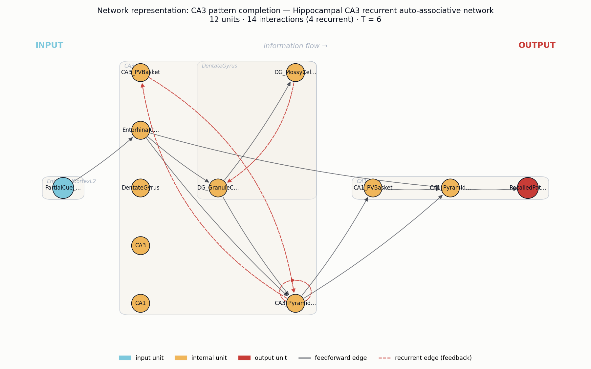
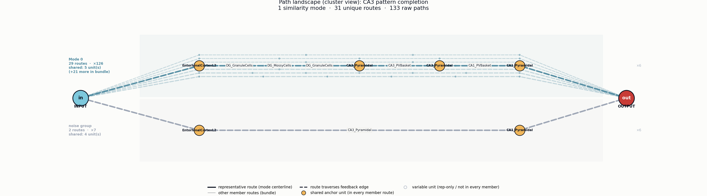

# Neural circuit analysis: CA3 pattern completion
*Four-agent path-representation pipeline.*

**Phenomenon (user input):** Pattern completion in the hippocampus from a partial cue

## Agent 1 — Research paper
**Pattern separation and pattern completion in the hippocampal system: Investigation of CA3 pattern completion using a custom-built large-scale model**

_Nakazawa, Quirk, Chitwood, Watanabe, Yeckel, Sun, Kato, Carr, Johnston, Wilson, Tonegawa_ (2002) — Science

This study used CA3-specific NMDA receptor knockout mice to show that the recurrent collateral network of hippocampal CA3 pyramidal cells supports pattern completion — the ability to recall a complete memory representation from a partial sensory cue. Place cell recordings and behavioral memory tests demonstrated that when familiar environmental cues were partially removed, control mice maintained stable place fields and spatial memory, whereas CA3-NR1 knockouts failed, implicating CA3 recurrent synapses and their plasticity as the circuit substrate of pattern completion.

Key findings:
- CA3 pyramidal neurons form an auto-associative recurrent collateral network hypothesized by Marr/Hopfield-style models to perform pattern completion.
- Genetic deletion of NMDA receptors specifically in CA3 impaired recall when only a subset of original spatial cues was available, while full-cue recall was intact.
- Place field stability in CA3 under degraded-cue conditions depended on NMDAR-mediated plasticity at recurrent synapses.
- Provides causal circuit-level evidence linking CA3 recurrent connectivity and synaptic plasticity to associative memory recall from partial cues.

Reference: `10.1126/science.1071795`

## Agent 2 — Neural system
**Hippocampal CA3 recurrent auto-associative network**

Brain regions: `Hippocampal CA3`, `Dentate gyrus`, `Entorhinal cortex (layer II)`, `Hippocampal CA1`

Neuron types: `CA3 pyramidal neurons`, `Dentate granule cells`, `Entorhinal layer II stellate cells`, `CA1 pyramidal neurons`, `PV+ basket interneurons`, `Mossy cells`

Circuit motifs: `Recurrent excitation (CA3 collaterals)`, `NMDAR-dependent Hebbian plasticity`, `Auto-associative attractor dynamics`, `Sparse mossy fiber input (detonator synapse)`, `Feedforward inhibition`, `Perforant path input`

CA3 pyramidal neurons are densely interconnected via recurrent collateral synapses equipped with NMDAR-dependent plasticity, forming a Marr/Hopfield-style auto-associative network. During encoding, sparse mossy fiber inputs from dentate granule cells drive CA3 pyramidal cells to potentiate recurrent synapses among co-active neurons. At recall, a partial entorhinal cue activates a subset of these neurons, and recurrent excitation reinstates the complete stored activity pattern as an attractor state, producing pattern completion.

## Agent 3 — Network representation

12 units (1 input, 10 internal, 1 output) · 14 interactions (4 recurrent) · T = 6

### Units

| name | role | scale | parent | description |
|---|---|---|---|---|
| `PartialCue_EC2` | input | 0 | EntorhinalCortexL2 | Entorhinal layer II stellate cells delivering a partial/degraded sensory cue via the perforant path. |
| `EntorhinalCortexL2` | internal | 1 |  | Entorhinal cortex layer II region; source of perforant path input to DG and CA3. |
| `DG_GranuleCells` | internal | 0 | DentateGyrus | Sparse, decorrelated granule cell code; drives CA3 via mossy fibers (detonator synapses) during encoding. |
| `DG_MossyCells` | internal | 0 | DentateGyrus | Hilar mossy cells providing associational excitation/inhibition within DG. |
| `DentateGyrus` | internal | 1 |  | Dentate gyrus region performing pattern separation prior to CA3. |
| `CA3_Pyramidal` | internal | 0 | CA3 | CA3 pyramidal neurons forming the auto-associative recurrent collateral network with NMDAR-dependent plasticity. |
| `CA3_PVBasket` | internal | 0 | CA3 | PV+ basket interneurons providing feedforward and feedback inhibition that controls sparsity and gain in CA3. |
| `CA3` | internal | 1 |  | Hippocampal CA3 region; Marr/Hopfield-style auto-associative attractor network. |
| `CA1_Pyramidal` | internal | 0 | CA1 | CA1 pyramidal neurons reading out the completed CA3 attractor pattern via Schaffer collaterals. |
| `CA1_PVBasket` | internal | 0 | CA1 | PV+ basket interneurons providing feedforward inhibition in CA1. |
| `CA1` | internal | 1 |  | Hippocampal CA1 region; output stage of the hippocampal trisynaptic loop. |
| `RecalledPattern` | output | 0 | CA1 | Reinstated complete memory representation observed as stable CA1 place-cell/ensemble activity. |

### Interactions

| source | target | weight | recurrent | description |
|---|---|---|---|---|
| `PartialCue_EC2` | `EntorhinalCortexL2` | 1.00 |  | Cue enters EC layer II. |
| `EntorhinalCortexL2` | `DG_GranuleCells` | 1.00 |  | Perforant path to DG (pattern separation pathway). |
| `EntorhinalCortexL2` | `CA3_Pyramidal` | 1.00 |  | Direct perforant path input to CA3 — delivers the partial cue used to seed completion. |
| `EntorhinalCortexL2` | `CA1_Pyramidal` | 0.50 |  | Temporoammonic perforant path to CA1. |
| `DG_GranuleCells` | `CA3_Pyramidal` | 1.50 |  | Sparse mossy fiber detonator synapses drive CA3 (dominant during encoding). |
| `DG_GranuleCells` | `DG_MossyCells` | 0.70 |  | Granule cell drive to hilar mossy cells. |
| `DG_MossyCells` | `DG_GranuleCells` | 0.50 | yes | Mossy cell associational feedback to granule cells. |
| `CA3_Pyramidal` | `CA3_Pyramidal` | 2.00 | yes | Recurrent collateral excitation with NMDAR-dependent Hebbian plasticity — the auto-associative substrate of pattern completion. |
| `CA3_Pyramidal` | `CA3_PVBasket` | 1.00 | yes | Recurrent drive of PV basket cells. |
| `CA3_PVBasket` | `CA3_Pyramidal` | 1.00 | yes | Feedback inhibition controlling sparsity and stabilising attractor states. |
| `CA3_Pyramidal` | `CA1_Pyramidal` | 1.20 |  | Schaffer collaterals carry the completed CA3 pattern to CA1. |
| `CA3_Pyramidal` | `CA1_PVBasket` | 0.70 |  | Schaffer collateral feedforward inhibition via PV interneurons. |
| `CA1_PVBasket` | `CA1_Pyramidal` | 0.80 |  | Feedforward inhibition shaping CA1 readout. |
| `CA1_Pyramidal` | `RecalledPattern` | 1.00 |  | CA1 ensemble activity expresses the recalled, completed memory. |

## Agent 4 — Path representation

- Unroll steps (T): **6**
- Intrinsic time scale: **5**
- Raw paths: **133** (feedforward-only: 5, feedback-traversing: 128)
- Unique routes (deduplicated): **31**
- Similarity modes (clusters): **1**
- Path length range: 3 – 16 (mean 9.75)

### Similarity modes

| mode | size | total count | mean length | feedforward | feedback | shared units | representative |
|---|---|---|---|---|---|---|---|
| Mode 0 | 29 | 126 | 9.9 | 0 | 29 | `PartialCue_EC2`, `EntorhinalCortexL2`, `CA3_Pyramidal`, `CA1_Pyramidal`, `RecalledPattern` | PartialCue_EC2 → EntorhinalCortexL2 → DG_GranuleCells → DG_MossyCells → DG_GranuleCells → CA3_Pyramidal → CA3_PVBasket → CA3_Pyramidal … |

### Description

The intrinsic time scale T=5 reflects roughly five recurrent passes through the CA3 collateral loop — the biological window over which CA3_Pyramidal cells iteratively refine their activity via auto-associative recurrence before CA1 readout. The five feedforward paths (EC2 → DG/CA3 → CA1 → RecalledPattern) carry the initial partial cue and feedforward inhibition through CA1_PVBasket, but they are dwarfed by 128 feedback-traversing paths that loop CA3_Pyramidal@t → CA3_Pyramidal@t+1, accumulating evidence across unroll steps. This overwhelming dominance of recurrent over feedforward paths is the path-level signature of attractor formation and pattern completion: a sparse, degraded EC2 cue is amplified and "cleaned up" by iterated CA3 self-excitation before being projected to CA1_Pyramidal as a fully recalled memory.

## Agent 5 — Landscape interpretation
**Emergence type:** attractor / pattern completion

A single dominant mode (94% of routes) with mandatory passage through CA3_Pyramidal recurrent collaterals and DG mossy-cell reentry — all 30 feedback routes converging on the same RecalledPattern readout — is the canonical signature of a fixed-point auto-associative attractor performing completion, not selection or competition (which would require ≥2 comparable modes).

### Dominant path-structural features

- **dominant cluster**  _( Mode 0 = 29/31 routes (94%), 126/133 raw paths (95%) )_: Mode 0 absorbs 29 of 31 unique routes (126 of 133 raw paths, 95%) and every route in it traverses feedback edges. All routes share the same five-unit backbone PartialCue_EC2 → EntorhinalCortexL2 → ... → CA3_Pyramidal → CA1_Pyramidal → RecalledPattern, indicating a single basin of computation rather than competing modes.
- **recurrent attractor**  _( feedback routes = 30/31; mean length 9.9 vs shortest 3 )_: 30 of 31 routes are feedback-traversing and the path length spans 3–16 with mean 9.9 — far longer than the 3-hop direct EC→CA3→CA1 shortcut. The representative route re-enters DG_GranuleCells via DG_MossyCells (DG→Mossy→DG loop) and CA3_Pyramidal recurrent collaterals, producing the long looping routes characteristic of attractor convergence.
- **shared hub**  _( CA3_Pyramidal in 100% of Mode 0 routes )_: CA3_Pyramidal and EntorhinalCortexL2 appear in the intersection of ALL Mode 0 routes — every completion path is forced through the CA3 recurrent hub before reaching CA1. This is the auto-associative bottleneck that performs the actual completion.
- **noise tail**  _( 7/133 raw paths (5%) bypass recurrence )_: The two noise routes (EC2→EC→CA3→CA1→Recalled, ×6; and EC2→EC→CA1→Recalled, ×1) are the short feedforward bypasses that skip recurrent dynamics. They represent fast, low-fidelity reads that don't engage the attractor — a small leak channel alongside the dominant recurrent mode.
- **compositional loop**  _( 4 recurrent edges; timescale 5 ≈ path mean 9.9 / 2 )_: The DG_GranuleCells ↔ DG_MossyCells reentry plus CA3 recurrent collaterals (4 recurrent edges over T=6, intrinsic timescale 5) generate the iterative refinement needed to fill in missing cue components before handoff to CA1.

### Mechanism

The partial cue enters via EntorhinalCortexL2 and is forced into the CA3 recurrent hub, which is shared by every route in Mode 0. Inside CA3, recurrent collaterals plus the DG_GranuleCells→DG_MossyCells→DG_GranuleCells reentry loop iterate the activity pattern over multiple traversals (mean length 9.9, up to 16 hops within T=6 timescale 5), allowing NMDAR-Hebbian-strengthened synapses to fill in missing components of the stored memory. Because there is only one similarity mode, the dynamics flow into one basin — the stored memory — and CA1_Pyramidal then reads out the completed pattern as RecalledPattern. The 7 noise paths are the perforant-path/EC→CA1 shortcut that delivers the raw cue without completion, explaining why partial cues still yield some output even when recurrence is impaired.

### Falsifiable prediction

If the CA3_Pyramidal recurrent collateral edges are ablated (e.g., by silencing CA3-CA3 transmission), Mode 0 would collapse from 29 routes to near zero and the path landscape would be dominated by the two short noise routes (EC2→EC→CA3→CA1→Recalled and EC2→EC→CA1→Recalled), observable experimentally as loss of pattern completion from degraded cues while direct cue-driven CA1 responses remain intact.
