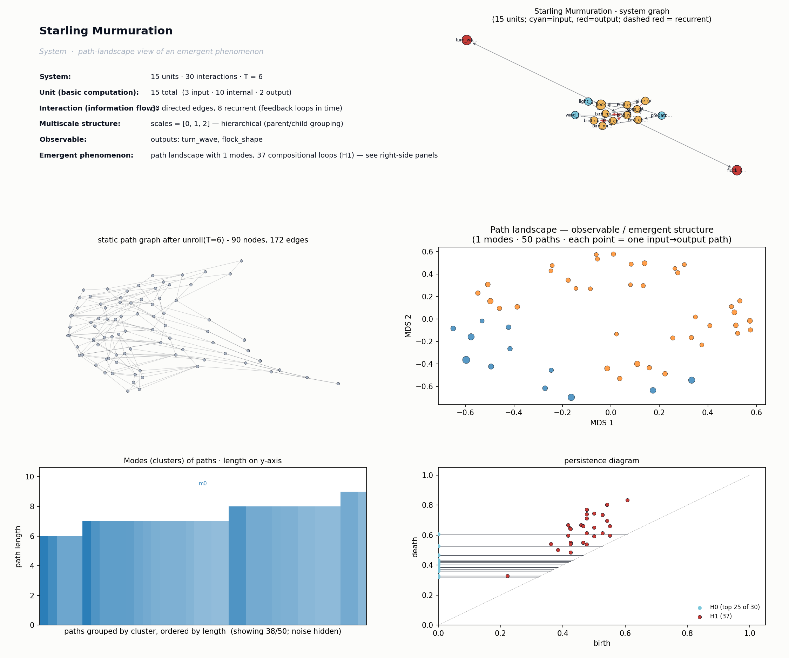

# Starling Murmuration
*Path-landscape analysis of an emergent phenomenon.*

## System specification
**Phenomenon:** Starling Murmuration
A flock of starlings produces coherent collective turning from local rules: each bird aligns velocity, avoids collisions, and stays cohesive with a small number of topological neighbors, yielding flock-scale waves of direction change.
SystemSpec('Starling Murmuration': 15 units [in=3 int=10 out=2], 30 interactions [recurrent=8], time_steps=6, scales=[0, 1, 2])

**External parameters:**
- `topological_neighbors` = 7: Number of nearest neighbors each bird attends to (classic value ~7)
- `flock_size` = 1000: Total number of birds; controls scale of collective
- `alignment_strength` = 0.8: Weight of velocity-matching rule vs noise
- `noise_level` = 0.1: Individual turning noise; tunes order-disorder transition

**Units:**
| name | role | scale | parent | description |
|---|---|---|---|---|
| `predator_cue` | input | 0 | flock | External threat / falcon appearance triggering edge-bird turn |
| `wind_field` | input | 0 | flock | Ambient air currents perturbing trajectories |
| `light_gradient` | input | 0 | flock | Visual contrast cue used by birds to detect neighbors |
| `bird_edge_1` | internal | 0 | edge_group | Peripheral bird, first to sense predator |
| `bird_edge_2` | internal | 0 | edge_group | Peripheral bird on opposite flank |
| `bird_mid_1` | internal | 0 | core_group | Mid-flock bird relaying alignment |
| `bird_mid_2` | internal | 0 | core_group | Mid-flock bird relaying alignment |
| `bird_mid_3` | internal | 0 | core_group | Mid-flock bird relaying alignment |
| `bird_core_1` | internal | 0 | core_group | Deep-core bird, mostly follows neighbors |
| `bird_core_2` | internal | 0 | core_group | Deep-core bird |
| `edge_group` | internal | 1 | flock | Module of peripheral birds that detect threats first |
| `core_group` | internal | 1 | flock | Module of interior birds that propagate alignment |
| `flock` | internal | 2 |  | Whole murmuration as a coherent body |
| `turn_wave` | output | 2 |  | Observed wave of synchronized direction change sweeping through the flock |
| `flock_shape` | output | 2 |  | Macroscopic shape / density pattern of the murmuration |

**Interactions:**
| source | target | weight | recurrent | description |
|---|---|---|---|---|
| `predator_cue` | `bird_edge_1` | 1.00 |  | Edge bird detects predator |
| `predator_cue` | `bird_edge_2` | 0.60 |  | Opposite edge sees with delay |
| `wind_field` | `bird_mid_1` | 0.30 |  |  |
| `wind_field` | `bird_core_1` | 0.30 |  |  |
| `light_gradient` | `bird_edge_1` | 0.40 |  | Visual neighbor detection |
| `light_gradient` | `bird_mid_2` | 0.40 |  |  |
| `bird_edge_1` | `bird_mid_1` | 1.00 |  | Topological neighbor alignment |
| `bird_edge_1` | `bird_mid_2` | 0.80 |  |  |
| `bird_edge_2` | `bird_mid_3` | 1.00 |  |  |
| `bird_mid_1` | `bird_mid_2` | 0.70 | yes | Mutual alignment feedback |
| `bird_mid_2` | `bird_mid_1` | 0.70 | yes |  |
| `bird_mid_2` | `bird_core_1` | 1.00 |  |  |
| `bird_mid_3` | `bird_core_2` | 1.00 |  |  |
| `bird_core_1` | `bird_core_2` | 0.70 | yes | Core cohesion feedback |
| `bird_core_2` | `bird_core_1` | 0.70 | yes |  |
| `bird_core_1` | `bird_mid_1` | 0.40 | yes | Back-propagation of cohesion pressure |
| `bird_core_2` | `bird_mid_3` | 0.40 | yes |  |
| `bird_edge_1` | `edge_group` | 1.00 |  |  |
| `bird_edge_2` | `edge_group` | 1.00 |  |  |
| `bird_mid_1` | `core_group` | 0.80 |  |  |
| `bird_mid_2` | `core_group` | 0.80 |  |  |
| `bird_mid_3` | `core_group` | 0.80 |  |  |
| `bird_core_1` | `core_group` | 1.00 |  |  |
| `bird_core_2` | `core_group` | 1.00 |  |  |
| `edge_group` | `flock` | 1.00 |  |  |
| `core_group` | `flock` | 1.00 |  |  |
| `edge_group` | `core_group` | 0.60 | yes | Inter-module propagation of turn |
| `core_group` | `edge_group` | 0.40 | yes |  |
| `flock` | `turn_wave` | 1.00 |  |  |
| `flock` | `flock_shape` | 1.00 |  |  |

**Notes:** Coarse-grained model: 7 representative birds stand in for thousands; modules abstract edge vs core dynamics. Topological (not metric) neighbor coupling and recurrent edges capture the propagating turn waves observed empirically.

## Path-landscape metrics

After unrolling feedback loops over T=6 and
coarsening to the lowest scale, the static path graph has
15 units and 30 edges.

- **Paths sampled:** 50
- **Modes (clusters):** 1
- **Path length range:** 4 - 9 (mean 6.86)
- **Cluster-size exponent (alpha):** nan (R² = nan)
- **H0 max persistence:** 0.607
- **H1 features (compositional loops):** 37, max persistence 0.295
- **Meta-graph:** 1 clusters, giant-component fraction 1.000, mean degree 0.00, density 0.000

**Representative paths (top clusters):**

- mode 0  (size 38, total weight 2.33, length 8):  `wind_field@0 -> bird_mid_1@0 -> bird_mid_2@1 ... flock@3 -> flock_shape@3`

## Mechanistic interpretation

**Path-structural mechanism.**
The dominant feature is **compositional loops**: 37 H1 features (max persistence 0.295) on only 30 edges and 15 units, indicating a dense web of recurrent recombination cycles rather than separated modes. Cluster topology is degenerate — a single mode (H0 persistence 0.607, giant fraction 1.000) absorbs all 50 sampled paths. This loop-dominated, single-mode structure produces flock-scale turn waves: perturbations recirculate through the topological-neighbor graph instead of branching into distinct behavioral clusters.

**Interpretation.**
Because each bird (bird_mid_1, bird_mid_2, …) couples to ~7 topological neighbors with recurrent edges, any directional change at the edge (wind_field, bird_edge units) feeds back through bird_mid into flock and flock_shape, then re-enters the mid layer. That recurrence is exactly what the 37 H1 loops encode — every path is a variation on the same cyclic motif terminating in flock_shape. With no mode separation, the system has one collective behavior (coherent turning) realized in many loop-equivalent ways, which is the murmuration signature: one global state, infinitely many microscopic realizations.

**Key bottleneck.**
The enabling feature is the **recurrence / H1-loop density** carried by the 8 recurrent edges linking bird_mid units back through flock. If alignment_strength dropped or noise_level rose past the order–disorder threshold, those loops would lose persistence first — H1 max persistence (0.295) would collapse before H0 changed. The single-mode structure depends entirely on these recurrent mid-layer cycles staying coherent.

**Falsifiable prediction.**
If `topological_neighbors` were reduced from ~7 toward 1–2, the recurrent loops through bird_mid would fragment, H1 feature count would drop sharply and the single mode would split into multiple weakly-connected clusters — observable as the flock breaking into independently-turning sub-flocks rather than propagating a single wave.
