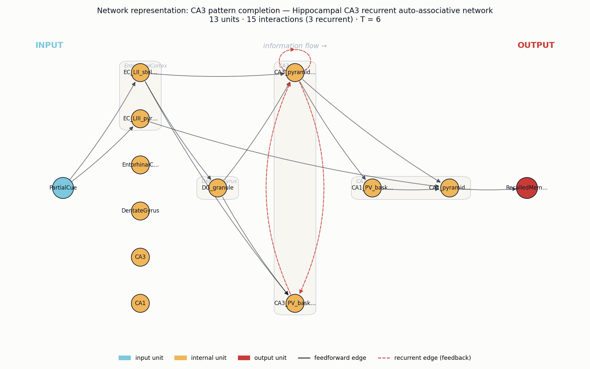
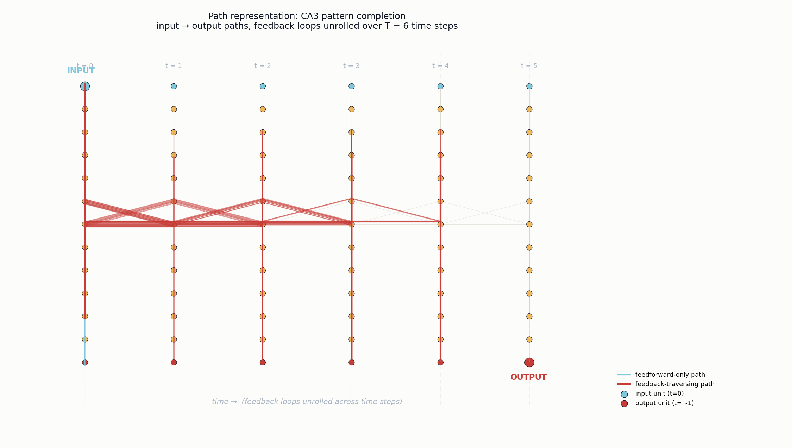

# Neural circuit analysis: CA3 pattern completion
*Four-agent path-representation pipeline.*

**Phenomenon (user input):** Pattern completion in the hippocampus from a partial cue

## Agent 1 — Research paper
**Transgenic inhibition of synaptic transmission reveals role of CA3 output in hippocampal learning**

_Nakazawa, Quirk, Chitwood, Watanabe, Yeckel, Sun, Kato, Carr, Johnston, Wilson, Tonegawa_ (2002) — Science

This paper provides the foundational experimental evidence that the recurrent CA3 network of the hippocampus implements pattern completion. By selectively knocking out NMDA receptors in CA3 pyramidal cells, the authors showed that mice could still form spatial memories under full-cue conditions but failed to recall them when given only partial environmental cues. This established the CA3 auto-associative recurrent collateral circuit as the substrate for pattern completion, validating the Marr/Hopfield-style attractor network theory of hippocampal memory.

Key findings:
- CA3 pyramidal neurons form a densely recurrent (auto-associative) network via recurrent collaterals, theorized by Marr to support pattern completion
- NMDA receptor-dependent plasticity at CA3-CA3 recurrent synapses is required for retrieval from partial cues, but not for encoding or full-cue recall
- CA3-specific NR1 knockout mice showed normal spatial memory with full cues but impaired recall when 3 of 4 extramaze cues were removed
- Place cell representations in CA1 (driven by CA3) were destabilized under partial-cue conditions in the mutants, linking the circuit deficit to representational pattern completion
- Provides direct circuit-level evidence that CA3 acts as an attractor network performing pattern completion, complementary to pattern separation in the dentate gyrus

Reference: `10.1126/science.1071795`

## Agent 2 — Neural system
**Hippocampal CA3 recurrent auto-associative network**

Brain regions: `Hippocampal CA3`, `Hippocampal CA1`, `Dentate gyrus`, `Entorhinal cortex`

Neuron types: `CA3 pyramidal neurons`, `Dentate granule cells (mossy fiber input)`, `Layer II entorhinal stellate cells (perforant path)`, `CA1 pyramidal neurons`, `PV+ basket interneurons`

Circuit motifs: `Recurrent excitation (CA3-CA3 collaterals)`, `Auto-associative attractor dynamics`, `NMDAR-dependent Hebbian plasticity`, `Sparse strong mossy-fiber 'detonator' input`, `Feedforward inhibition via interneurons`

Dense recurrent collaterals among CA3 pyramidal neurons, strengthened by NMDAR-dependent Hebbian plasticity during encoding, form an auto-associative attractor network. When a partial cue arrives via the perforant path, the recurrent excitatory loops reactivate the full stored ensemble, completing the pattern. Mossy fiber inputs from dentate granule cells seed encoding, while CA1 reads out the completed pattern; feedforward inhibition keeps activity sparse and stabilizes attractor states.

## Agent 3 — Network representation

13 units (1 input, 11 internal, 1 output) · 15 interactions (3 recurrent) · T = 6

### Units

| name | role | scale | parent | description |
|---|---|---|---|---|
| `PartialCue` | input | 0 |  | Partial environmental/sensory cue (subset of original encoding context). |
| `EC_LII_stellate` | internal | 0 | EntorhinalCortex | Layer II entorhinal stellate cells; perforant path projection carrying cortical input to DG and CA3. |
| `EC_LIII_pyramidal` | internal | 0 | EntorhinalCortex | Layer III entorhinal pyramidal cells; temporoammonic path to CA1. |
| `EntorhinalCortex` | internal | 1 |  | Entorhinal cortex region (parent). |
| `DG_granule` | internal | 0 | DentateGyrus | Dentate granule cells; sparse pattern-separated codes feeding CA3 via mossy fibers (detonator synapses). |
| `DentateGyrus` | internal | 1 |  | Dentate gyrus region (parent). |
| `CA3_pyramidal` | internal | 0 | CA3 | CA3 pyramidal neurons with dense recurrent collaterals; auto-associative attractor substrate. |
| `CA3_PV_basket` | internal | 0 | CA3 | PV+ basket interneurons providing feedforward/feedback inhibition that sparsifies and stabilizes CA3 attractor states. |
| `CA3` | internal | 1 |  | CA3 subfield (parent). |
| `CA1_pyramidal` | internal | 0 | CA1 | CA1 pyramidal neurons; read out the completed CA3 ensemble via Schaffer collaterals. |
| `CA1_PV_basket` | internal | 0 | CA1 | PV+ basket interneurons in CA1 providing feedforward inhibition. |
| `CA1` | internal | 1 |  | CA1 subfield (parent). |
| `RecalledMemory` | output | 0 |  | Reactivated full memory ensemble / behavioural recall observable. |

### Interactions

| source | target | weight | recurrent | description |
|---|---|---|---|---|
| `PartialCue` | `EC_LII_stellate` | 1.00 |  | Cortical sensory cue enters entorhinal cortex. |
| `PartialCue` | `EC_LIII_pyramidal` | 0.80 |  | Cue also drives EC layer III. |
| `EC_LII_stellate` | `DG_granule` | 1.00 |  | Perforant path to dentate gyrus. |
| `EC_LII_stellate` | `CA3_pyramidal` | 0.60 |  | Direct perforant path to CA3 (delivers partial cue). |
| `EC_LII_stellate` | `CA3_PV_basket` | 0.40 |  | Feedforward drive to CA3 inhibitory interneurons. |
| `DG_granule` | `CA3_pyramidal` | 1.50 |  | Sparse strong mossy fiber 'detonator' input seeding CA3 ensemble. |
| `DG_granule` | `CA3_PV_basket` | 0.50 |  | Mossy fiber collaterals recruit feedforward inhibition. |
| `CA3_pyramidal` | `CA3_pyramidal` | 1.20 | yes | Recurrent collaterals (NMDAR-dependent Hebbian) — auto-associative attractor; substrate of pattern completion. |
| `CA3_pyramidal` | `CA3_PV_basket` | 0.60 | yes | Recurrent excitation drives feedback inhibition. |
| `CA3_PV_basket` | `CA3_pyramidal` | 1.00 | yes | Feedback/feedforward inhibition sparsifies and stabilizes attractor states. |
| `CA3_pyramidal` | `CA1_pyramidal` | 1.00 |  | Schaffer collateral projection; CA1 reads out completed pattern. |
| `CA3_pyramidal` | `CA1_PV_basket` | 0.40 |  | Schaffer collaterals recruit CA1 feedforward inhibition. |
| `EC_LIII_pyramidal` | `CA1_pyramidal` | 0.50 |  | Temporoammonic path provides direct EC input to CA1 for comparison/readout. |
| `CA1_PV_basket` | `CA1_pyramidal` | 0.80 |  | Feedforward inhibition in CA1. |
| `CA1_pyramidal` | `RecalledMemory` | 1.00 |  | CA1 output expresses the recalled memory. |

## Agent 4 — Path representation

- Unroll steps (T): **6**
- Intrinsic time scale: **4**
- Paths total: **50** (feedforward-only: 5, feedback-traversing: 45)
- Path length range: 3 – 10 (mean 7.24)

### Description

The intrinsic time scale T=4 corresponds to the recurrent settling time of the CA3 auto-associative loop — roughly the number of CA3_pyramidal->CA3_pyramidal collateral traversals needed for the attractor to converge after a partial cue arrives via EC_LII_stellate and DG_granule mossy-fiber input. The five feedforward paths (PartialCue -> EC -> [DG] -> CA3 -> CA1 -> RecalledMemory) represent the fast, single-shot readout that would only suffice if the cue were already complete, while the 45 feedback-traversing paths threading repeated CA3_pyramidal@t -> CA3_pyramidal@t+1 steps embody the iterative collateral reverberation. This 9:1 dominance of recurrent over feedforward paths is the structural signature of pattern completion: a degraded PartialCue is progressively filled in across CA3 iterations before CA1_pyramidal reads out a stable RecalledMemory attractor.
