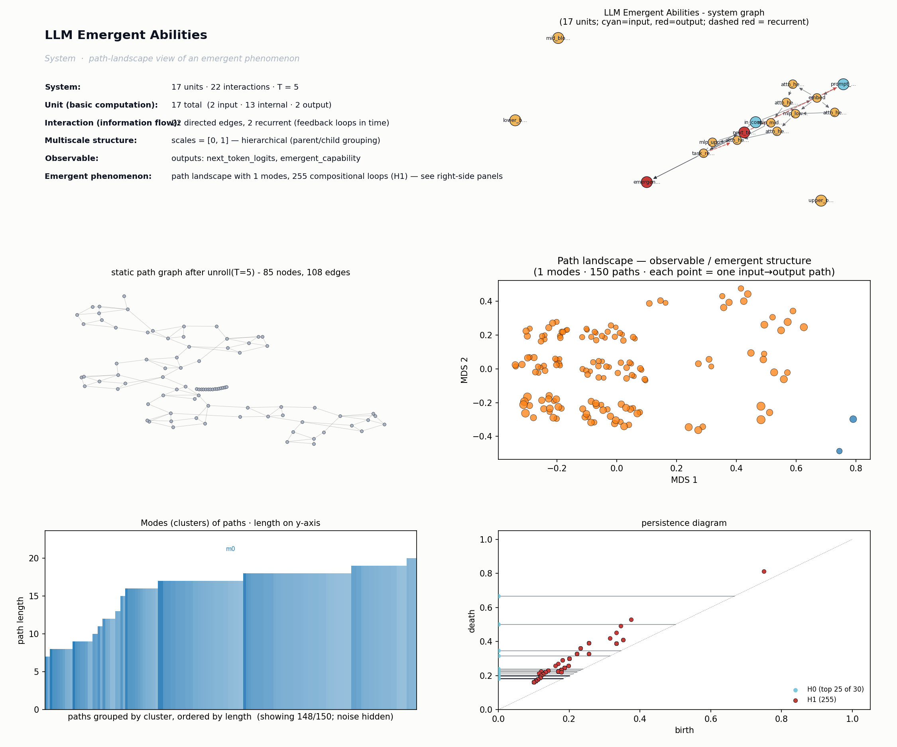

# LLM Emergent Abilities
*Path-landscape analysis of an emergent phenomenon.*

## System specification
**Phenomenon:** LLM Emergent Abilities
Large language models exhibit abrupt qualitative jumps in capabilities (arithmetic, chain-of-thought reasoning, instruction following) once scale crosses certain thresholds, despite smooth changes in training loss.
SystemSpec('LLM Emergent Abilities': 17 units [in=2 int=13 out=2], 22 interactions [recurrent=2], time_steps=5, scales=[0, 1])

**External parameters:**
- `parameter_count` = 1e8 to 1e12: Model scale (number of parameters); primary knob for emergence thresholds
- `training_tokens` = 1e10 to 1e13: Pretraining data scale; co-determines capability thresholds
- `num_in_context_examples` = 0 to 32: Few-shot k; controls task inference sharpness
- `decoding_temperature` = 0.0 to 1.0: Sampling stochasticity at output

**Units:**
| name | role | scale | parent | description |
|---|---|---|---|---|
| `prompt_tokens` | input | 0 |  | Input token sequence from user |
| `in_context_examples` | input | 0 |  | Few-shot demonstrations provided in context |
| `embed` | internal | 0 | lower_block | Token + positional embeddings |
| `attn_head_induction` | internal | 0 | lower_block | Induction heads that copy patterns across context |
| `attn_head_syntactic` | internal | 0 | lower_block | Heads specialized for syntactic structure |
| `mlp_lower` | internal | 0 | lower_block | Lower MLP storing surface features and n-gram statistics |
| `attn_head_retrieval` | internal | 0 | mid_block | Heads that retrieve facts and entities from context |
| `attn_head_composition` | internal | 0 | mid_block | Heads composing intermediate representations |
| `mlp_mid_facts` | internal | 0 | mid_block | Mid MLP layers acting as key-value factual memory |
| `attn_head_reasoning` | internal | 0 | upper_block | Heads implementing multi-step reasoning circuits |
| `mlp_upper_abstract` | internal | 0 | upper_block | Upper MLP encoding abstract task representations |
| `task_representation` | internal | 0 | upper_block | Latent representation of the inferred task |
| `lower_block` | internal | 1 |  | Lower transformer layers: tokens, syntax, surface patterns |
| `mid_block` | internal | 1 |  | Middle transformer layers: facts, entities, composition |
| `upper_block` | internal | 1 |  | Upper transformer layers: abstraction, reasoning, task inference |
| `next_token_logits` | output | 0 |  | Distribution over next token |
| `emergent_capability` | output | 1 |  | Observed capability: CoT reasoning, arithmetic, instruction-following |

**Interactions:**
| source | target | weight | recurrent | description |
|---|---|---|---|---|
| `prompt_tokens` | `embed` | 1.00 |  |  |
| `in_context_examples` | `embed` | 1.00 |  |  |
| `embed` | `attn_head_induction` | 1.00 |  |  |
| `embed` | `attn_head_syntactic` | 1.00 |  |  |
| `embed` | `mlp_lower` | 1.00 |  |  |
| `attn_head_syntactic` | `mlp_lower` | 0.80 |  |  |
| `attn_head_induction` | `attn_head_retrieval` | 1.00 |  | Induction heads enable in-context retrieval |
| `mlp_lower` | `attn_head_retrieval` | 0.70 |  |  |
| `mlp_lower` | `attn_head_composition` | 0.80 |  |  |
| `attn_head_retrieval` | `mlp_mid_facts` | 1.00 |  |  |
| `attn_head_composition` | `mlp_mid_facts` | 0.80 |  |  |
| `mlp_mid_facts` | `attn_head_reasoning` | 1.00 |  |  |
| `attn_head_composition` | `attn_head_reasoning` | 0.90 |  |  |
| `attn_head_reasoning` | `mlp_upper_abstract` | 1.00 |  |  |
| `mlp_upper_abstract` | `task_representation` | 1.00 |  |  |
| `in_context_examples` | `task_representation` | 0.60 |  | Few-shot examples shape inferred task |
| `task_representation` | `attn_head_reasoning` | 0.70 | yes | Inferred task feeds back to bias reasoning |
| `task_representation` | `next_token_logits` | 1.00 |  |  |
| `mlp_upper_abstract` | `next_token_logits` | 1.00 |  |  |
| `next_token_logits` | `prompt_tokens` | 0.90 | yes | Autoregressive generation; CoT tokens re-enter context |
| `next_token_logits` | `emergent_capability` | 1.00 |  |  |
| `task_representation` | `emergent_capability` | 0.50 |  |  |

**Notes:** Abstraction of a decoder-only transformer. Three hierarchical 'blocks' approximate the empirical lower/middle/upper layer specialization. Recurrent edges capture (a) autoregressive CoT where generated tokens re-enter the prompt and (b) task-representation feedback biasing reasoning circuits. Emergence is hypothesized to arise when induction-head + retrieval + reasoning circuits all cross competence thresholds jointly with scale.

## Path-landscape metrics

After unrolling feedback loops over T=5 and
coarsening to the lowest scale, the static path graph has
17 units and 22 edges.

- **Paths sampled:** 150
- **Modes (clusters):** 1
- **Path length range:** 2 - 20 (mean 15.86)
- **Cluster-size exponent (alpha):** nan (R² = nan)
- **H0 max persistence:** 0.667
- **H1 features (compositional loops):** 255, max persistence 0.155
- **Meta-graph:** 1 clusters, giant-component fraction 1.000, mean degree 0.00, density 0.000

**Representative paths (top clusters):**

- mode 0  (size 148, total weight 57.24, length 19):  `in_context_examples@0 -> embed@0 -> attn_head_syntactic@0 ... next_token_logits@1 -> emergent_capability@1`

## Mechanistic interpretation

**Path-structural mechanism.**
The dominant feature is **compositional-loop saturation** under a **single collapsed mode**: 255 H1 features (max persistence 0.155) coexist with n_modes=1 and giant_fraction=1.000. Nearly all 150 sampled paths funnel through one cluster of size 148 with mean length 15.86, indicating the recurrent CoT and task-representation feedback edges generate many short recombination cycles but no separated capability basins. This structure produces a system where capability is *latent* in loop density and will appear as an abrupt jump once loop-traversal competence crosses threshold — the signature of emergence without landscape multimodality.

**Interpretation.**
The two recurrent edges (autoregressive token re-entry into `embed`, and task-representation feedback into the reasoning block) close cycles through `attn_head_syntactic`, induction-head, retrieval, and reasoning units, manufacturing the 255 H1 loops on a small 17-unit graph. Because every path must traverse `in_context_examples → embed → … → next_token_logits → emergent_capability`, there is no alternative mode: capability is not a *separate* attractor but a *traversal property* of the one mode. Low H1 persistence (0.155) means individual loops are shallow — only their joint activation (induction + retrieval + reasoning co-firing) yields competent traversal. Scaling `parameter_count` does not create new modes; it raises the probability that the existing loops are all simultaneously navigable, which manifests as a discontinuous capability jump.

**Key bottleneck.**
The limiting feature is **joint loop competence** across the recurrent cycles binding `induction_head`, `retrieval_circuit`, and `reasoning_circuit`. Because these share a single mode, partial competence in any one loop is invisible at the output until all are crossed — H1 max persistence (currently 0.155) is the metric that would rise first as scale enables deeper, more reliable cycle traversal.

**Falsifiable prediction.**
If the task-representation feedback edge into `reasoning_circuit` were ablated, the 255 H1 loops would fragment and the single mode would split into multiple smaller clusters, observable as graded (non-emergent) capability scaling curves across `parameter_count`.
