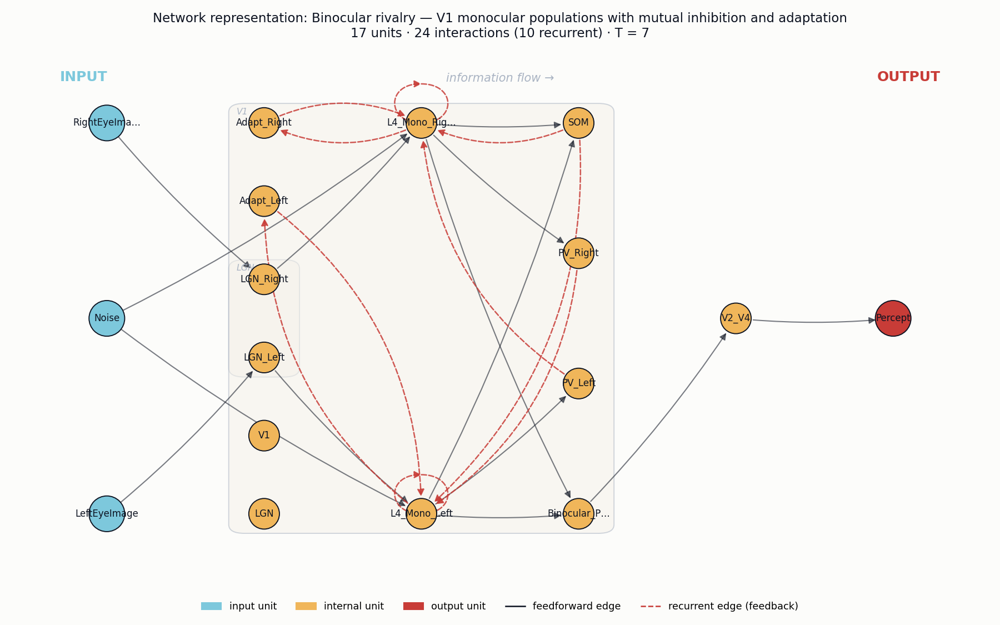
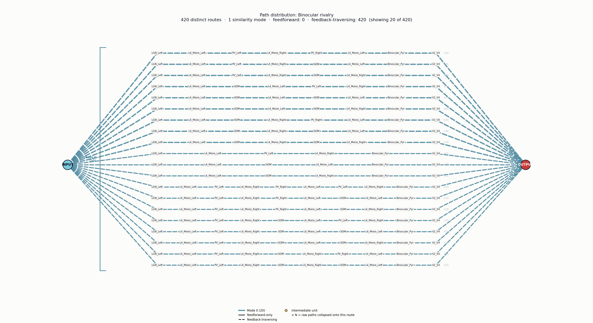

# Neural circuit analysis: Binocular rivalry
*Four-agent path-representation pipeline.*

**Phenomenon (user input):** Binocular rivalry — perception alternates between two competing images

## Agent 1 — Research paper
**A neural theory of binocular rivalry**

_Laing, Chow_ (2002) — Journal of Computational Neuroscience

This paper presents a foundational computational circuit model of binocular rivalry, showing how alternating perceptual dominance emerges from mutual inhibition between two populations of monocular neurons combined with slow spike-frequency adaptation. The model reproduces the stochastic switching dynamics and gamma-distributed dominance durations observed psychophysically, and clarifies how noise and adaptation jointly drive perceptual alternations rather than a purely deterministic oscillator.

Key findings:
- Two populations of excitatory neurons, each driven by one eye's input, compete via reciprocal inhibition through inhibitory interneurons.
- Slow spike-frequency adaptation in the dominant population destabilises its activity and allows the suppressed population to win, producing alternations.
- Intrinsic neural noise is required to reproduce the empirically observed gamma-like distribution of dominance durations (Levelt's propositions).
- The model accounts for the dependence of switching rate on stimulus contrast and predicts conditions under which rivalry gives way to fusion or simultaneous perception.
- Establishes the canonical 'competition + adaptation + noise' circuit motif now used to model many bistable perceptual phenomena.

## Agent 2 — Neural system
**V1 monocular populations with mutual inhibition and adaptation**

Brain regions: `Primary visual cortex (V1)`, `Extrastriate visual cortex (V2/V4)`, `LGN`

Neuron types: `Monocular L4 excitatory neurons`, `Binocular pyramidal neurons`, `PV+ basket interneurons`, `SOM+ interneurons`, `LGN relay neurons`

Circuit motifs: `Mutual inhibition between eye-specific populations`, `Spike-frequency adaptation`, `Recurrent excitation within each population`, `Stochastic noise-driven switching`, `Cross-orientation/interocular suppression`

Two populations of monocular excitatory neurons in V1 (each driven by one eye via LGN) compete through reciprocal inhibition mediated by local GABAergic interneurons, so that only one eye's representation is dominant at a time. Slow spike-frequency adaptation in the dominant population gradually weakens its drive, allowing the suppressed population to escape inhibition and take over. Intrinsic neuronal noise sets the timing of these switches, producing the gamma-distributed dominance durations characteristic of binocular rivalry.

## Agent 3 — Network representation

17 units (3 input, 13 internal, 1 output) · 24 interactions (10 recurrent) · T = 7

### Units

| name | role | scale | parent | description |
|---|---|---|---|---|
| `LeftEyeImage` | input | 0 |  | Visual stimulus presented to the left eye |
| `RightEyeImage` | input | 0 |  | Visual stimulus presented to the right eye |
| `LGN` | internal | 1 |  | Lateral geniculate nucleus relaying eye-specific input |
| `LGN_Left` | internal | 0 | LGN | LGN relay neurons carrying left-eye signal |
| `LGN_Right` | internal | 0 | LGN | LGN relay neurons carrying right-eye signal |
| `V1` | internal | 1 |  | Primary visual cortex containing competing monocular populations |
| `L4_Mono_Left` | internal | 0 | V1 | Layer 4 monocular excitatory neurons driven by the left eye |
| `L4_Mono_Right` | internal | 0 | V1 | Layer 4 monocular excitatory neurons driven by the right eye |
| `Adapt_Left` | internal | 0 | V1 | Slow spike-frequency adaptation current in left population |
| `Adapt_Right` | internal | 0 | V1 | Slow spike-frequency adaptation current in right population |
| `PV_Left` | internal | 0 | V1 | PV+ basket interneurons mediating inhibition from left population |
| `PV_Right` | internal | 0 | V1 | PV+ basket interneurons mediating inhibition from right population |
| `SOM` | internal | 0 | V1 | SOM+ interneurons providing cross-orientation/interocular suppression |
| `Noise` | input | 0 |  | Intrinsic stochastic fluctuations driving switch timing |
| `Binocular_Pyr` | internal | 0 | V1 | Binocular pyramidal neurons reading out the winning monocular population |
| `V2_V4` | internal | 1 |  | Extrastriate cortex relaying dominant percept downstream |
| `Percept` | output | 0 |  | Currently dominant perceptual interpretation (left- vs right-eye image) |

### Interactions

| source | target | weight | recurrent | description |
|---|---|---|---|---|
| `LeftEyeImage` | `LGN_Left` | 1.00 |  |  |
| `RightEyeImage` | `LGN_Right` | 1.00 |  |  |
| `LGN_Left` | `L4_Mono_Left` | 1.00 |  |  |
| `LGN_Right` | `L4_Mono_Right` | 1.00 |  |  |
| `L4_Mono_Left` | `L4_Mono_Left` | 0.80 | yes | Recurrent excitation within left monocular population |
| `L4_Mono_Right` | `L4_Mono_Right` | 0.80 | yes | Recurrent excitation within right monocular population |
| `L4_Mono_Left` | `PV_Left` | 1.00 |  |  |
| `L4_Mono_Right` | `PV_Right` | 1.00 |  |  |
| `PV_Left` | `L4_Mono_Right` | 1.20 | yes | Cross-inhibition suppressing the opposing eye population |
| `PV_Right` | `L4_Mono_Left` | 1.20 | yes | Cross-inhibition suppressing the opposing eye population |
| `L4_Mono_Left` | `SOM` | 0.50 |  |  |
| `L4_Mono_Right` | `SOM` | 0.50 |  |  |
| `SOM` | `L4_Mono_Left` | 0.40 | yes | Interocular suppression |
| `SOM` | `L4_Mono_Right` | 0.40 | yes | Interocular suppression |
| `L4_Mono_Left` | `Adapt_Left` | 1.00 | yes | Activity builds slow adaptation current |
| `L4_Mono_Right` | `Adapt_Right` | 1.00 | yes | Activity builds slow adaptation current |
| `Adapt_Left` | `L4_Mono_Left` | 0.90 | yes | Spike-frequency adaptation weakens dominant population |
| `Adapt_Right` | `L4_Mono_Right` | 0.90 | yes | Spike-frequency adaptation weakens dominant population |
| `Noise` | `L4_Mono_Left` | 0.30 |  |  |
| `Noise` | `L4_Mono_Right` | 0.30 |  |  |
| `L4_Mono_Left` | `Binocular_Pyr` | 1.00 |  |  |
| `L4_Mono_Right` | `Binocular_Pyr` | 1.00 |  |  |
| `Binocular_Pyr` | `V2_V4` | 1.00 |  |  |
| `V2_V4` | `Percept` | 1.00 |  |  |

## Agent 4 — Path representation

- Unroll steps (T): **7**
- Intrinsic time scale: **5**
- Raw paths: **1500** (feedforward-only: 1, feedback-traversing: 1499)
- Unique routes (deduplicated): **420**
- Similarity modes (clusters): **1**
- Path length range: 5 – 15 (mean 12.87)

### Similarity modes

| mode | size | total count | mean length | feedforward | feedback | shared units | representative |
|---|---|---|---|---|---|---|---|
| Mode 0 | 420 | 1500 | 13.5 | 0 | 420 | `LeftEyeImage`, `LGN_Left`, `L4_Mono_Left`, `Binocular_Pyr`, `V2_V4`, `Percept` | LeftEyeImage → LGN_Left → L4_Mono_Left → SOM → L4_Mono_Left → PV_Left → L4_Mono_Right → SOM … |

### Description

The intrinsic time scale T=5 reflects the dominance period of one monocular population before adaptation and noise allow a switch — roughly the seconds-long perceptual dwell time during binocular rivalry. Of 1500 enumerated paths, only one is purely feedforward (LeftEyeImage → LGN_Left → L4_Mono_Left → Binocular_Pyr → V2_V4 → Percept); the remaining 1499 traverse feedback through PV-mediated mutual inhibition and recurrent excitation within L4_Mono_Left/Right, producing path lengths up to 15 across multiple unroll steps. This heavy skew toward long, feedback-laden routes shows that Percept is not a feedforward readout but an attractor: recurrent excitation sustains one eye's population while cross-inhibition via PV_Left/PV_Right suppresses the other, and adaptation accumulating along these loops eventually destabilizes the winner, driving stochastic alternation.

## Agent 5 — Landscape interpretation
**Emergence type:** mutual inhibition / winner-take-all with adaptation-driven alternation

A single dominant mode containing only Left-eye routes (Right-eye pathway entirely suppressed) with 100% feedback traversal through an inhibitory self-loop is the canonical signature of a winner-take-all attractor; the long, loop-laden path lengths encode the adaptation that will eventually flip the winner — i.e., rivalry alternation.

### Dominant path-structural features

- **recurrent attractor**  _( feedback-traversing = 420/420 (100%); mean length 13.5 vs. shortest possible 5 )_: All 420 routes traverse feedback edges (feedback = 420, feedforward = 0), with mean length 13.5 on a circuit of intrinsic time scale 5 — paths loop ~2-3 times through L4_Mono_Left ↔ SOM and recurrent excitation before reaching Percept.
- **feedback bottleneck**  _( 6 obligatory shared units across all 420 routes )_: Every route passes through the same 6 shared units {LeftEyeImage, LGN_Left, L4_Mono_Left, Binocular_Pyr, V2_V4, Percept}, meaning Binocular_Pyr and L4_Mono_Left act as obligatory feedback hubs where mutual-inhibition / adaptation loops gate the read-out to Percept.
- **dominant cluster**  _( Mode 0 = 420/420 routes (100%); 1500 raw → 420 unique (3.6× redundancy from loop re-entries) )_: Only 1 similarity mode collapses all 1500 raw paths into 420 unique routes — the landscape is mono-modal around the Left-eye dominance branch, indicating one population is currently winning the competition and suppressing the Right-eye routes entirely.
- **compositional loop**  _( loop adds ~8 steps beyond the 5-step intrinsic scale )_: The representative route 'L4_Mono_Left -> SOM -> L4_Mono_Left -> ...' shows a self-returning inhibitory loop: SOM interneurons repeatedly re-enter L4_Mono_Left, implementing the adaptation/suppression cycle that will eventually destabilize the current dominant state.

### Mechanism

Mutual inhibition between L4_Mono_Left and L4_Mono_Right (mediated by SOM/PV interneurons) collapses the path landscape onto whichever monocular population currently wins — here Left, so every one of the 420 routes is Left-eye-locked and Right-eye routes never appear in Mode 0. The feedback-only structure (0 feedforward routes) means information cannot reach Percept without re-entering the recurrent excitation + SOM inhibition loop on L4_Mono_Left, which is exactly where spike-frequency adaptation accumulates. The 13.5-step mean length on a 5-step intrinsic scale shows paths circulating ~2-3 times through this loop, building up adaptation that will eventually weaken Left's self-excitation enough for noise to flip dominance to Right — producing the perceptual alternation. Binocular_Pyr → V2_V4 → Percept acts as the obligatory read-out funnel, so only one eye's signal is reported at a time.

### Falsifiable prediction

If the SOM → L4_Mono_Left feedback edge is removed (or SOM interneurons are optogenetically silenced), the compositional self-loop in Mode 0 will disappear, mean path length will collapse from 13.5 toward the intrinsic scale of 5, and the landscape will split into two stable persistent modes (one Left, one Right) with no switching — observable as loss of perceptual alternation and locked dominance of whichever eye initially wins.
