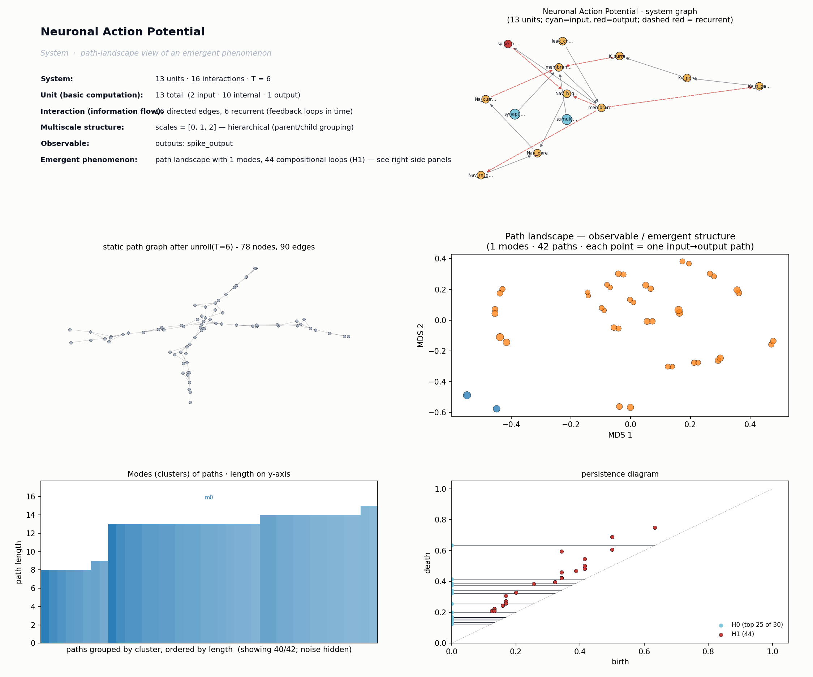

# Neuronal Action Potential
*Path-landscape analysis of an emergent phenomenon.*

## System specification
**Phenomenon:** Neuronal Action Potential
The all-or-none membrane voltage spike that emerges from the nonlinear, voltage-dependent gating of sodium and potassium ion channels in a neuronal membrane patch.
SystemSpec('Neuronal Action Potential': 13 units [in=2 int=10 out=1], 16 interactions [recurrent=6], time_steps=6, scales=[0, 1, 2])

**External parameters:**
- `g_Na_max` = 120 mS/cm^2: Maximum sodium conductance — sets spike amplitude and excitability.
- `g_K_max` = 36 mS/cm^2: Maximum potassium conductance — controls repolarization speed.
- `temperature` = 6.3 C: Scales gating kinetics (Q10 factor).
- `stimulus_amplitude` = variable: Drives the system above or below firing threshold.

**Units:**
| name | role | scale | parent | description |
|---|---|---|---|---|
| `stimulus_current` | input | 0 |  | External depolarizing current injected into the membrane patch. |
| `synaptic_input` | input | 0 |  | Ligand-gated channel current from upstream synapses. |
| `Nav_m_gate` | internal | 0 | Nav_channel | Activation gate of voltage-gated Na+ channel; opens rapidly with depolarization. |
| `Nav_h_gate` | internal | 0 | Nav_channel | Inactivation gate of Na+ channel; closes slowly with depolarization. |
| `Nav_pore` | internal | 1 | membrane_patch | Effective Na+ conductance (product of m and h gate states). |
| `Kv_n_gate` | internal | 0 | Kv_channel | Activation gate of delayed-rectifier K+ channel; opens slowly with depolarization. |
| `Kv_pore` | internal | 1 | membrane_patch | Effective K+ conductance from delayed rectifier channels. |
| `leak_channel` | internal | 1 | membrane_patch | Passive leak conductance setting resting potential. |
| `Na_current` | internal | 1 | membrane_patch | Inward Na+ current driven by gradient and Nav conductance. |
| `K_current` | internal | 1 | membrane_patch | Outward K+ current driven by gradient and Kv conductance. |
| `membrane_capacitance` | internal | 1 | membrane_patch | Integrates net current into a voltage change across the lipid bilayer. |
| `membrane_voltage` | internal | 1 | membrane_patch | Transmembrane potential Vm; the state variable that gates channels. |
| `spike_output` | output | 2 | neuron | Detected action potential: the emergent all-or-none voltage spike propagated downstream. |

**Interactions:**
| source | target | weight | recurrent | description |
|---|---|---|---|---|
| `stimulus_current` | `membrane_capacitance` | 1.00 |  | Injected current charges the membrane. |
| `synaptic_input` | `membrane_capacitance` | 0.80 |  | Synaptic current contributes to charging. |
| `membrane_capacitance` | `membrane_voltage` | 1.00 |  | Integrated charge becomes voltage (V = Q/C). |
| `membrane_voltage` | `Nav_m_gate` | 1.00 | yes | Depolarization rapidly opens activation gate. |
| `membrane_voltage` | `Nav_h_gate` | 0.60 | yes | Sustained depolarization slowly closes inactivation gate. |
| `membrane_voltage` | `Kv_n_gate` | 0.70 | yes | Depolarization slowly opens K+ activation gate. |
| `Nav_m_gate` | `Nav_pore` | 1.00 |  | m^3 term sets channel openness. |
| `Nav_h_gate` | `Nav_pore` | 1.00 |  | h term gates inactivation. |
| `Kv_n_gate` | `Kv_pore` | 1.00 |  | n^4 term sets K+ conductance. |
| `Nav_pore` | `Na_current` | 1.00 |  | Conductance times driving force gives I_Na. |
| `Kv_pore` | `K_current` | 1.00 |  | Conductance times driving force gives I_K. |
| `leak_channel` | `membrane_voltage` | 0.30 |  | Leak current pulls Vm toward rest. |
| `Na_current` | `membrane_capacitance` | 1.00 | yes | Inward Na+ further depolarizes — positive feedback core of the spike. |
| `K_current` | `membrane_capacitance` | 1.00 | yes | Outward K+ repolarizes — negative feedback that terminates the spike. |
| `membrane_voltage` | `spike_output` | 1.00 |  | Threshold crossing is read out as an action potential. |
| `spike_output` | `Nav_h_gate` | 0.50 | yes | Post-spike inactivation enforces the refractory period. |

**Notes:** Hodgkin–Huxley-style abstraction. The action potential emerges from a fast positive-feedback loop (Vm → Nav_m → Na_current → Vm) bounded by two slower negative-feedback loops (Nav inactivation and Kv activation). Multiscale hierarchy: gates → channels → membrane patch → neuron.

## Path-landscape metrics

After unrolling feedback loops over T=6 and
coarsening to the lowest scale, the static path graph has
13 units and 16 edges.

- **Paths sampled:** 42
- **Modes (clusters):** 1
- **Path length range:** 3 - 15 (mean 12.00)
- **Cluster-size exponent (alpha):** nan (R² = nan)
- **H0 max persistence:** 0.633
- **H1 features (compositional loops):** 44, max persistence 0.253
- **Meta-graph:** 1 clusters, giant-component fraction 1.000, mean degree 0.00, density 0.000

**Representative paths (top clusters):**

- mode 0  (size 40, total weight 19.15, length 14):  `synaptic_input@0 -> membrane_capacitance@0 -> membrane_voltage@0 ... membrane_voltage@4 -> spike_output@4`

## Mechanistic interpretation

**Path-structural mechanism.**
The system exhibits a single-mode landscape (n_modes=1, giant fraction=1.000) dominated by **compositional loops**: 44 H1 features against only 16 edges, indicating dense recurrent recombination among the 6 feedback edges. H0 persistence (0.633) confirms one tight basin with no competing modes. This loop-saturated, single-mode structure produces the stereotyped all-or-none spike: every trajectory funnels through the same recurrent core, yielding one canonical waveform rather than a family of outcomes.

**Interpretation.**
The dominant path-structural feature is the **recurrent loop family** wrapping membrane_voltage with Nav_m (fast positive feedback), Nav_h (slow inactivation), and Kv_n (slow repolarization). Because every sampled path threads membrane_voltage at successive time steps, membrane_voltage acts as a temporal **hub** that all 42 paths share, collapsing the landscape to one mode. The 44 H1 loops are the unrolled images of the three physical feedback cycles across T=6 — their high count relative to edges is exactly what enforces the threshold nonlinearity and the refractory return. The absence of secondary clusters reflects that subthreshold and suprathreshold inputs converge onto the same attractor path once the Nav_m loop ignites.

**Interpretation hub note**: synaptic_input and membrane_capacitance serve only as entry units; the structural work is done inside the membrane_voltage ↔ Nav_m ↔ Na_current cycle.

**Key bottleneck.**
The limiting feature is the **positive-feedback compositional loop** membrane_voltage → Nav_m → Na_current → membrane_voltage. If its loop gain drops (e.g., via g_Na_max), H1 persistence on that cycle collapses first, and the single mode would split into a subthreshold mode plus the spike mode — n_modes shifts from 1 to 2 before any H0 change.

**Falsifiable prediction.**
If g_Na_max is reduced below the regenerative threshold, the Nav_m positive-feedback loop disappears from H1, the cluster structure bifurcates into two modes (passive decay vs. spike), observable as a bimodal distribution of path lengths and a drop in mean H1 persistence.
